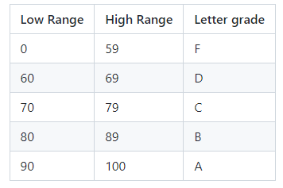

# CONVERT GRADES FROM NUMERIC TO A,B,C.. etc
## General information

Write a program which will ask the user to input a numeric grade from 0 to 100.
Use the input to figure out the letter grade which corresponds to the numeric grade, based on the following table:






## Step 1: accept user input

First try to accept user input into a variable and display that value.

## Step 2: if-then-else

Then, construct the if-them-else statement and display the resulting letter grade.



## Step 3: Run your program to see if it compiles and executes

```
python grades.py
```
## Step 4: Test

Test your code with various input and see if the output is the expected one!


 
## Check your code, using the check tool
 
```
check50  mkotsovoulou/python/main/labs/grades
```

## Check the styling of your code, using the style tool
 
```
style50 grades.py
```

## Submit your work 

```
submit50  mkotsovoulou/python/main/labs/grades
```

DONE!
 
